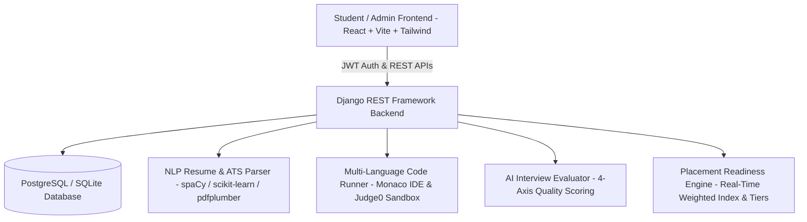

# 🎓 Placement Preparation Portal

A production-grade, full-stack campus placement readiness platform engineered with **React (Vite), Tailwind CSS, Django REST Framework, PostgreSQL, and NLP AI Engines**.

---

## 🌟 Key Modules & Architecture



---

### 1. 📊 Placement Readiness Index & Dashboard
- **Composite Readiness Formula**:
  $$\text{Readiness Index} = (0.25 \times \text{Aptitude}) + (0.30 \times \text{Coding}) + (0.20 \times \text{Resume}) + (0.25 \times \text{Interview})$$
- **Dynamic Readiness Tiers**:
  - `Beginner (0–40%)`
  - `Developing (41–60%)`
  - `Good (61–75%)`
  - `Placement Ready (76–90%)`
  - `Excellent (91–100%)`
- **100% Database-Backed Progress Timeline**: Real-time 7-day chronological progress trend charting individual student attempts and performance growth.
- **Competency Radar & Analytics**: Multi-axis readiness radar, category accuracy breakdown, and streak tracking.
- **Interactive Recent Practice Activity**: Direct click-to-review navigation for recent aptitude tests, coding submissions, resumes, and interview attempts.

---

### 2. 🧮 Company-Specific Aptitude & Placement Tests
- **Company Mock Lineup**: Tailored hiring assessment patterns for **TCS NQT, Infosys, Wipro, Accenture, Cognizant, Amazon, Google, Capgemini, Deloitte, and Microsoft**.
- **Dynamic Practice Generator**: On-demand custom drills with flexible question counts (**5, 10, 15, 20, 25, 30, 40, 50 Questions**) and scaled timers.
- **Comprehensive Question Bank**: 60+ curated questions across **Quantitative Aptitude, Logical Reasoning, Verbal Ability, and Data Interpretation**.
- **Assessment Runner**: Interactive question palette, countdown timer, negative marking options, and automated submission with detailed answer reviews.

---

### 3. 💻 Coding Practice & DSA Arena
- **49+ High-Frequency Placement Challenges** structured across standard DSA tracks:
  - **🔢 Sorting**: Dutch National Flag (Sort Colors), Merge Sort, Quick Sort, Valid Anagram.
  - **🔗 Linked Lists**: Reverse Linked List, Cycle Detection (Floyd's), Middle Node, Remove Nth Node From End, Merge Two Sorted Lists.
  - **↔️ Doubly Linked List**: LRU Cache Design, Browser History, Flatten Multilevel DLL, Reverse DLL, Delete Node.
  - **📚 Stacks & Queues**: Valid Parentheses, Min Stack, Daily Temperatures (Monotonic Stack), Evaluate Reverse Polish Notation, Queue using Stacks.
  - **🌳 Trees & BST**: Invert Binary Tree, Validate BST, Maximum Depth, Diameter of Binary Tree, Level Order Traversal (BFS), Lowest Common Ancestor (LCA).
  - **🌐 Graphs & Matrix**: Number of Islands (BFS/DFS), Rotting Oranges (Multi-source BFS), Course Schedule (Topological Sort), Clone Graph, Word Ladder, Flood Fill, Surrounded Regions.
  - **📊 Arrays & Two Pointers**: Two Sum, 3Sum, Container With Most Water, Best Time to Buy & Sell Stock, Rotate Array, Maximum Subarray (Kadane's).
  - **🧩 Dynamic Programming**: Climbing Stairs, Coin Change, House Robber, Longest Increasing Subsequence (LIS), Trapping Rain Water.
- **Monaco IDE & Multi-Language Runner**: In-browser compiler supporting **Python, JavaScript, C++, Java, C, Go, Rust, and 15+ languages** with real-time test case evaluation.

---

### 4. 📄 AI-Powered Resume & ATS Analyzer
- **Multi-Format Extraction**: PDF and DOCX parsing via `pdfplumber` and `python-docx` with raw text paste fallback.
- **8-Category ATS Breakdown**: Technical Skills, Education, Experience, Projects, Certifications, Keyword Density, Layout Structure, and Compliance.
- **Resume vs Job Description Matcher**: TF-IDF cosine similarity vectorizer comparing uploaded resumes against target job descriptions with instant skill gap analysis.

---

### 5. 🎙️ AI Mock Interview Preparation
- **Structured Question Categories**: HR, Technical, Behavioral (STAR methodology), Resume-based, and Company-Specific prompts.
- **4-Axis AI Evaluation**:
  - Relevance (0–10)
  - Communication Clarity & Flow (0–10)
  - Technical Correctness & Depth (0–10)
  - Delivery Confidence (0–10)
- **Model Answer Comparison**: Side-by-side comparison between student response and ideal answer with key talking points.

---

### 6. 🛡️ Administrator Operations Center
- **Institutional Analytics**: Batch readiness averages, participation statistics, and tier distributions.
- **Student Roster Inspector**: Search, branch filters, and individual diagnostic performance dossiers.
- **Question & Problem Management**: Full CRUD operations for Aptitude MCQs, Coding Challenges, and Interview Questions.
- **Placement Reports & Export**: One-click batch performance CSV export for college placement cells.

---

## 🚀 Quickstart Guide

### Prerequisites
- **Python 3.10+**
- **Node.js 18+** & **npm**
- **PostgreSQL** (optional; SQLite fallback runs automatically out of the box)

---

### Step 1: Backend Setup

```bash
cd backend

# 1. Create and activate virtual environment
python3 -m venv ../.venv
source ../.venv/bin/activate

# 2. Install dependencies
pip install -r requirements.txt

# 3. Download spaCy English NLP model
python -m spacy download en_core_web_sm

# 4. Run database migrations
python manage.py migrate

# 5. Seed initial mock tests, DSA problems, questions, and demo accounts
python manage.py seed_data

# 6. Run unit tests
python manage.py test

# 7. Start Django development server
python manage.py runserver 127.0.0.1:8000
```

---

### Step 2: Frontend Setup

```bash
cd ../frontend

# 1. Install frontend dependencies
npm install --legacy-peer-deps

# 2. Start Vite development server
npm run dev
```

Open your browser at: **`http://localhost:3000`**

---

## 🔑 Default Demo Credentials

| Role | Email | Password |
| :--- | :--- | :--- |
| **Student** | `student@placement.com` | `Student@123456` |
| **Admin** | `admin@placement.com` | `Admin@123456` |

> 💡 *Both demo accounts can also be auto-filled directly from the Login page using the quick-demo buttons.*

---

## 📡 Core REST API Endpoints

### Authentication & Profiles (`/api/auth/`)
- `POST /api/auth/register/` - Register new student account
- `POST /api/auth/login/` - JWT login (returns `access` & `refresh` tokens)
- `GET /api/auth/profile/` - View current student/admin profile
- `PUT /api/auth/profile/update/` - Update profile, branch, skills, and links
- `POST /api/auth/change-password/` - Update password

### Aptitude System (`/api/aptitude/`)
- `GET /api/aptitude/categories/` - List categories & question counts
- `GET /api/aptitude/tests/` - List company mock tests
- `GET /api/aptitude/tests/<id>/` - Retrieve test with questions
- `POST /api/aptitude/practice/generate/` - Generate dynamic practice drill
- `POST /api/aptitude/attempts/` - Submit test attempt & receive score breakdown
- `GET /api/aptitude/history/` - View previous test attempts

### Coding Arena (`/api/coding/`)
- `GET /api/coding/problems/` - List DSA challenges (supports search & topic filters)
- `GET /api/coding/problems/<id>/` - Problem details and multi-language starter codes
- `POST /api/coding/run/` - Sandbox code execution against sample inputs
- `POST /api/coding/problems/<id>/submit/` - Evaluate all test cases and record score
- `GET /api/coding/submissions/` - Submission history

### Resume & Job Matcher (`/api/resume/`)
- `POST /api/resume/upload/` - Upload PDF/DOCX resume for NLP ATS analysis
- `GET /api/resume/history/` - View uploaded resumes & historical scores
- `POST /api/resume/match-jd/` - Compute resume vs JD TF-IDF match & skill gaps

### Interview Preparation (`/api/interview/`)
- `GET /api/interview/categories/` - List interview categories
- `GET /api/interview/questions/` - List interview questions & model answers
- `POST /api/interview/submit-answer/` - Submit answer for 4-axis AI evaluation
- `GET /api/interview/history/` - View mock interview scores

### Dashboard & Analytics (`/api/dashboard/`)
- `GET /api/dashboard/summary/` - Student readiness score, recommendations & streak
- `GET /api/dashboard/progress/` - Historical progress logs and 7-day chart data
- `GET /api/dashboard/admin/analytics/` - Batch averages and tier distribution
- `GET /api/dashboard/admin/reports/` - Filtered student performance registry
- `GET /api/dashboard/admin/export-csv/` - Export batch performance data to CSV

---

## 🧪 Testing & Verification

Backend automated unit tests:
```bash
cd backend
../.venv/bin/python manage.py test
```
Result: **`Ran 16 tests ... OK`**

Frontend production bundle verification:
```bash
cd frontend
npm run build
```
Result: **`✓ built in ~400ms`**
# Placement-Prepretion-Portal
# Placement-Prepretion-Portal
# Placement-Prepretion-Portal
